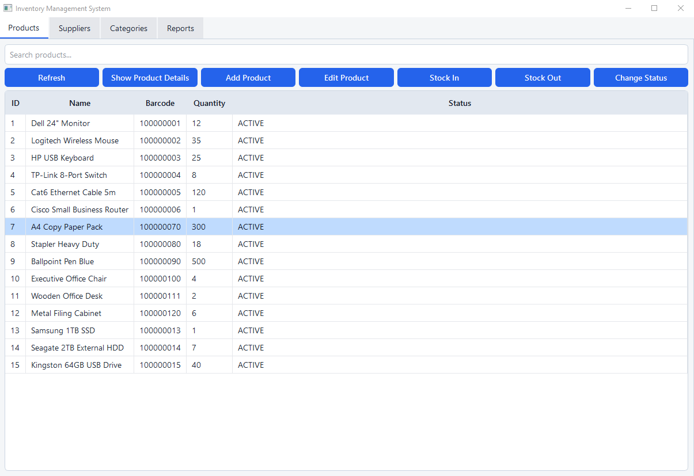
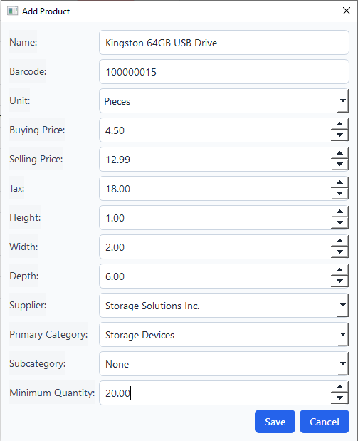
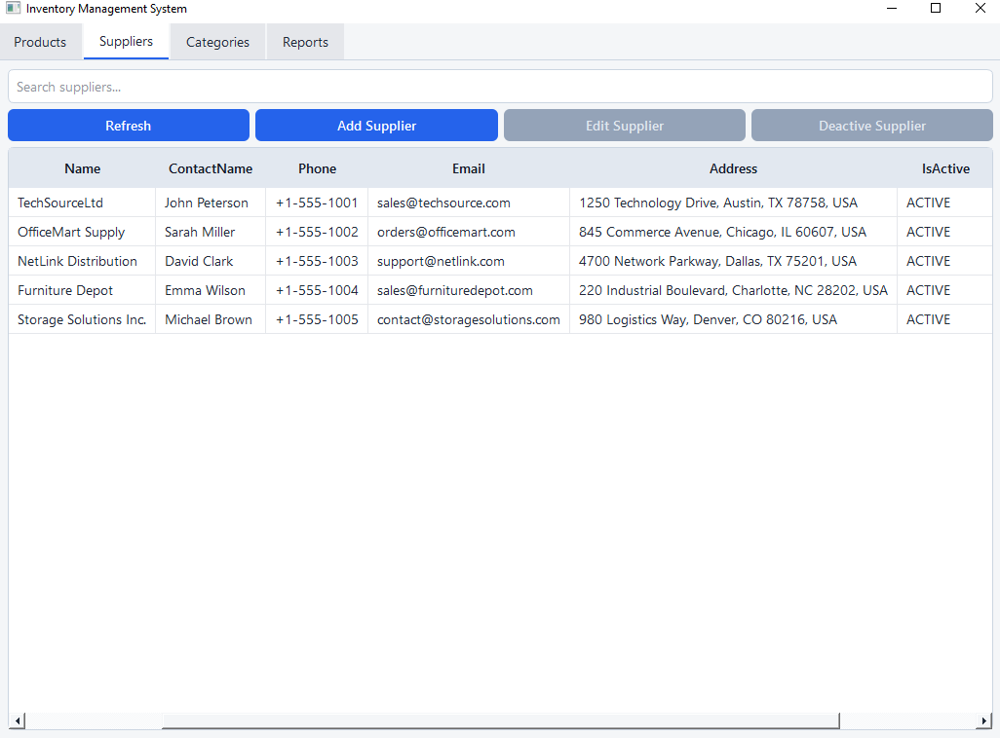
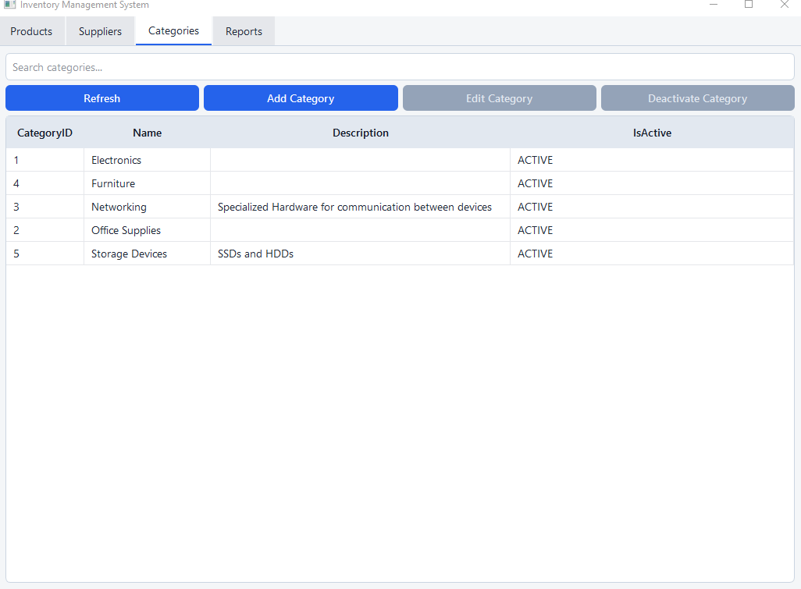
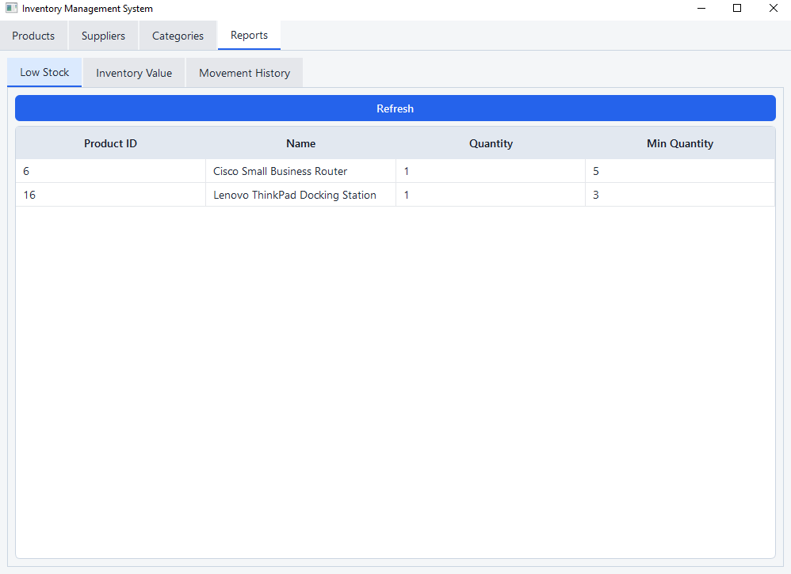
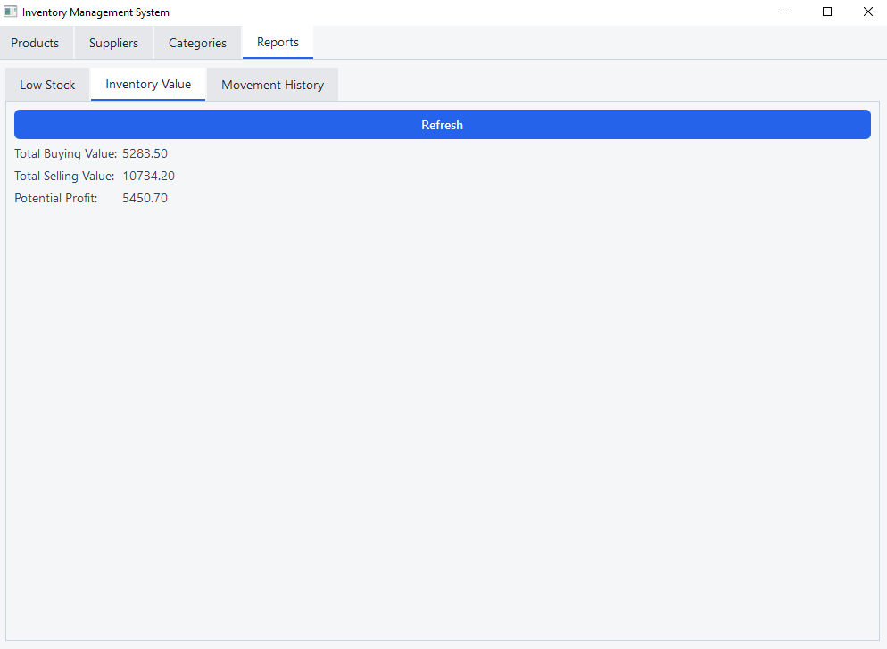
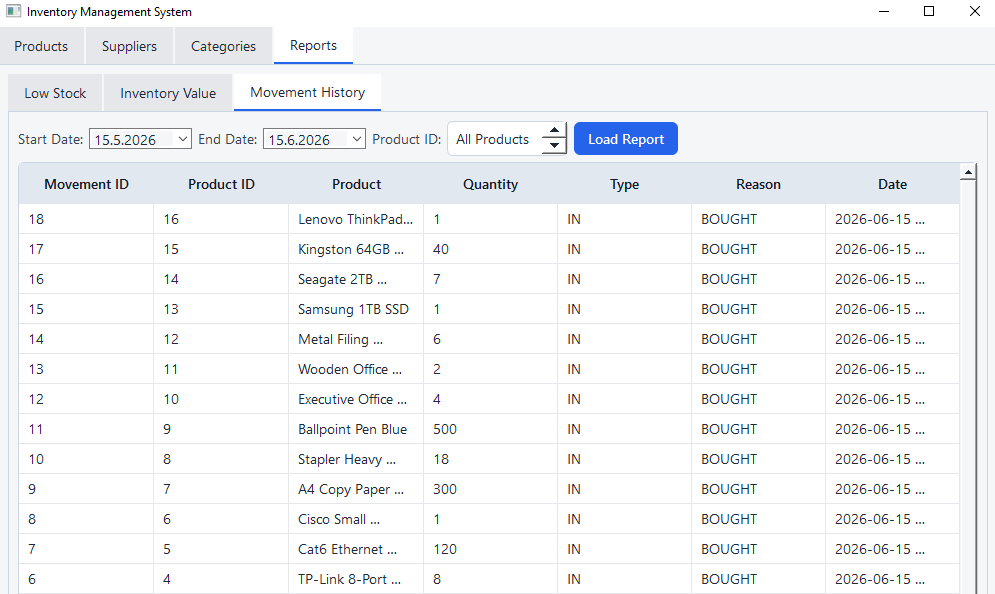
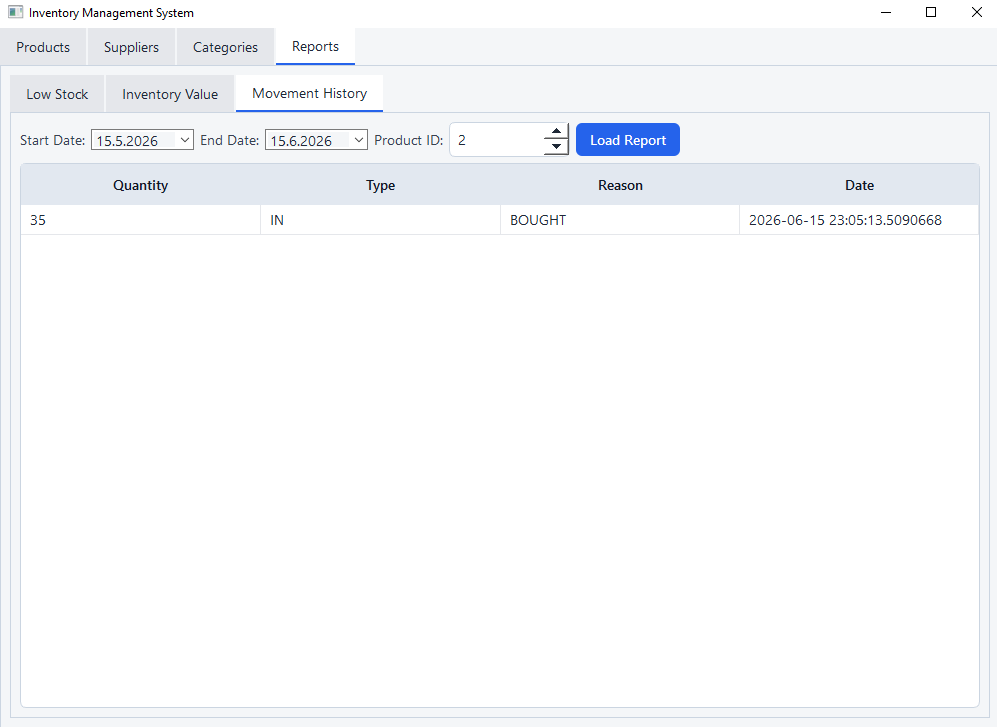

# Inventory Management System

Developed as a personal portfolio project to demonstrate practical software engineering skills in C++, Qt desktop development, SQL Server integration, and layered architecture design.

The application allows users to manage products, suppliers, categories, stock movements, and inventory reports through an intuitive graphical interface. The project follows a layered architecture that separates the user interface, business logic, data access, and database layers.

---

# Highlights

* Built with C++17 and Qt 6
* SQL Server integration through ODBC
* Layered architecture (GUI → Service → Repository → Database)
* Transaction-safe inventory operations
* Business rule validation
* Inventory reporting system
* Custom Qt Widget-based desktop UI

# Features

## Product Management

* Add new products
* Edit existing products
* Search products by name
* Change product status
* Configure minimum stock levels
* Product validation and business rule enforcement

## Supplier Management

* Add suppliers
* Edit supplier information
* Search suppliers
* Deactivate suppliers
* Validation against duplicate or invalid data

## Category Management

* Add categories
* Edit categories
* Search categories
* Deactivate categories

## Inventory Operations

* Stock In
* Stock Out
* Movement reason tracking
* Transaction-safe stock updates
* Inventory validation rules

## Reporting

* Inventory valuation report
* Low stock report
* Stock movement history

---

# Technologies Used

## Frontend

* Qt 6 Widgets
* Qt Layout System
* Qt Dialogs
* Qt Style Sheets (QSS)

## Backend

* C++17
* Object-Oriented Programming
* Service Layer Architecture
* Repository Pattern
* Exception Handling

## Database

* Microsoft SQL Server
* ODBC API
* Transactions
* Relational Database Design

The complete database schema can be found in `database/schema.sql`.
---

# Architecture

Dependencies flow in a single direction from the GUI layer down to the database layer, keeping business logic isolated from presentation concerns.

```text
┌─────────────┐
│     GUI     │
└──────┬──────┘
       │
┌──────▼──────┐
│  Services   │
└──────┬──────┘
       │
┌──────▼──────┐
│Repositories │
└──────┬──────┘
       │
┌──────▼──────┐
│  Database   │
└─────────────┘
```

## GUI Layer

Responsible for user interaction and presentation.

## Service Layer

Contains business rules, validation, and coordinates transactional operations.

## Repository Layer

Handles communication with the database.

## Database Layer

Responsible for establishing and managing SQL Server connections.

---

# Validation Rules

## Products

* Product name is required
* Barcode is required
* Barcode must be unique
* Stock movement amount must be greater than zero
* Products cannot be assigned to inactive categories
* Products cannot be assigned to inactive suppliers
* Blocked products cannot have stock modifications
* Inactive products cannot receive stock

## Suppliers

* Supplier name is required
* Cannot deactivate an already inactive supplier

## Categories

* Category name is required
* Cannot deactivate an already inactive category

---

# Screenshots

## Product Management


## Add Product Dialog


## Supplier Management


## Category Management


## Reports

### Low Stock Report


### Inventory Value Report


### Movement History Report


### Movement History Per Product


---

# Example Workflow

1. Create a supplier
2. Create a category
3. Create a product
4. Perform stock-in operations
5. Perform stock-out operations
6. Generate inventory reports

---

# Lessons Learned

This project provided practical experience with:

* Modern C++ development
* Object-Oriented Programming
* Layered software architecture
* Repository Pattern
* SQL Server database design
* ODBC database connectivity
* Qt desktop application development
* Transaction management
* Input validation
* Exception handling
* GUI development

---

# Build Requirements

* C++17 compatible compiler
* Qt 6
* Microsoft SQL Server
* ODBC Driver for SQL Server
* CMake
* SQL Server database configured using `config.ini`
---

# Setup

1. Create a SQL Server database.
2. Execute `database/schema.sql`.
3. (Optional) Execute `database/seed.sql`.
4. Copy `config.example.ini` to `config.ini` and update server name.
5. Update the SQL Server connection settings.
6. Build the project using CMake.
7. Launch the application.